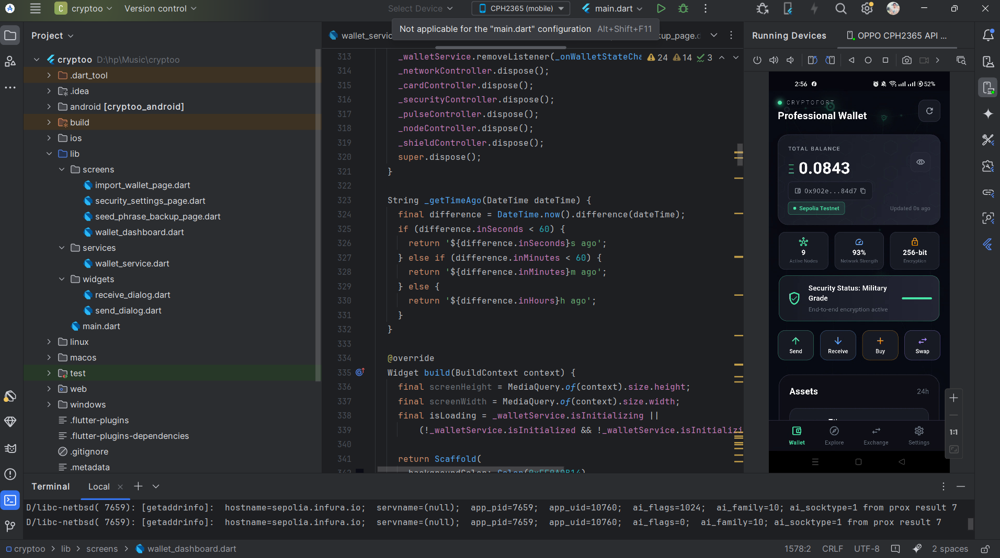

<div align="center">

# 🌐 CryptoVault Premium

### The Future of Ethereum Wallet Experience


<br>

[](https://flutter.dev)
[](https://ethereum.org)
[](https://blockchain.com)
[](https://dart.dev)
[](https://sepolia.etherscan.io)

<br>


---

### 💎 Where Security Meets Elegance in Blockchain

*Experience the next generation of cryptocurrency wallets with living blockchain visualization*

</div>

---

## 📋 Table of Contents

- [🎯 Overview](#-overview)
- [✨ Key Features](#-what-makes-it-special)
- [⚡ Technology Stack](#-technology-stack)
- [📸 Preview 1](#-preview-1)
- [📸 Preview 2](#-preview-2)
- [📸 Preview 3](#-preview-3)
- [🚀 Getting Started](#-getting-started)
- [💻 Installation](#-installation)
- [📄 License](#-license)
- [📞 Contact](#-connect-and-support)


---

## 🎯 Overview

**CryptoVault Premium** is not just another cryptocurrency wallet—it's a **living blockchain experience**. Built with cutting-edge Flutter technology and integrated with Ethereum's Sepolia testnet, this premium wallet transforms complex blockchain interactions into an elegant, intuitive interface.

<div align="center">
  
  
  <video src="https://github.com/user-attachments/assets/96a513b3-64ae-4e71-be2b-250f63175b21" controls width="100%" ></video>

    
</div>


---


### 🌟 What Makes It Special?
#### **🔒 Security Features (Production-Ready!)**
- 🔐 **Biometric Authentication**: Supports Face ID and Fingerprint recognition for secure access.
- 🔑 **BIP39 Seed Phrase Generation**: Generate a 12-word recovery phrase for wallet recovery.
- 💾 **Secure Storage**: Utilizes FlutterSecureStorage for encrypted data storage.
- 📥 **Import Wallet**: Easily recover your wallet using the seed phrase.


#### **💰 Wallet Features**
- 💸 **Send ETH**: Send Ethereum with automatic gas estimation.
- 📨 **Receive ETH**: Receive Ethereum using address copy.
- 💵 **Real-time Balance**: Balance auto-refreshes every 15 seconds for up-to-date information.
- 🔍 **Transaction Status**: Track transaction status from Pending to Confirmed with a timer.
- 🌐 **Sepolia Testnet Explorer**:  Utilize a safe testing environment for development and testing purposes.
  

  
#### **💰 🎨 Professional UI/UX**
- 🎭 **Living Interface:** Animated network nodes that pulse in the background(Different each time)
- 🎨 **Premium Design:**  smooth animations, and thoughtful micro-interactions


#### 🔧 **Technical Excellence**
- 📡 **Web3 Integration**: - Full Web3 integration with Ethereum blockchain
- ⛓️ **Blockchain Interaction**: Direct interaction with Ethereum via RPC.
- ✅ **Etherscan Verified:** All transactions verifiable on Etherscan explorer

  ---
## 🎬 Preview 1
  
*Introducing CryptoVault Premium: a revolutionary cryptocurrency wallet delivering a dynamic blockchain experience with a sleek interface and seamless integration with Ethereum's Sepolia testnet*

<div align="left">
  <table>
    <tr>
      <td><video src="https://github.com/user-attachments/assets/5c1ef64a-322f-49fa-ab28-72ba763838d3" controls width="49%"></video></td>
      <td>  <video src="https://github.com/user-attachments/assets/cafa7541-235a-421b-b6b0-b88a4c03afe6" controls width="49%"></video></td>
      <td>  <video src="https://github.com/user-attachments/assets/e1f1c6cd-9baf-4461-9bf1-59616f20b399" controls width="49%"></video></td>
    </tr>
  </table>
</div>

---

## ⚡ Technology Stack

<div align="center">

### **Frontend Framework**


### **Blockchain & Web3**


</div>

### **Key Packages**

```yaml
dependencies:
  flutter: sdk: flutter
  
  # Blockchain & Web3
  web3dart: ^2.7.1              # Ethereum integration
  http: ^1.1.0                  # HTTP requests


  # UI & Animations
  flutter_animate: ^4.3.0       # Advanced animations
  shimmer: ^3.0.0               # Shimmer effects
  
  # Security
  flutter_secure_storage: ^9.0.0  # Secure key storage
  
  # Utilities
  share_plus: ^7.2.1            # Sharing functionality
  animated_text_kit: ^4.2.2     # For animation
  intl: ^0.18.1                 # Internationalization
```

---

## 🎬 Preview 2
  
*Experience seamless transfer and verification of ETH amounts with CryptoVault Premium, your ultimate cryptocurrency wallet for effortless blockchain interactions.*

<div align="left">
  <table>
    <tr>
      <td><video src="https://github.com/user-attachments/assets/96608ac4-c287-41a3-8eb0-f3f656531af0" controls width="49%"></video></td>
      <td>  <video src="https://github.com/user-attachments/assets/591c5557-3172-426e-a6e9-556014210240" controls width="49%"></video></td>
      <td>  <video src="https://github.com/user-attachments/assets/6eb28082-9f8b-415d-a6a5-f18b2aa12cb8" controls width="49%"></video></td>
    </tr>
  </table>
</div>

---

## 📸 Transaction Details

<div align="center">
  <table>
    <tr>
      <td></td>
    </tr>
  </table>
</div>


---
## 🎬 Preview 3
  
*Utilize BIP39 Seed Phrase Generation to create a 12-word recovery phrase for easy wallet recovery, and seamlessly restore your wallet with the generated seed phrase.*

<div align="Center">
  <table>
    <tr>
      <td><video src="https://github.com/user-attachments/assets/450c98aa-b238-4c14-a977-2cc9d03e14ac" controls width="49%"></video></td>
      <td>  <video src="https://github.com/user-attachments/assets/0a144cb0-ff4e-455f-9990-990a58b63444" controls width="49%"></video></td>
    </tr>
  </table>
</div>

---

## 🚀 Getting Started
<div align="center">
  <table>
    <tr>
      <td></td>
    </tr>
  </table>
</div>


### **Prerequisites**

Before you begin, ensure you have the following installed:

- **Flutter SDK:** 3.16.0 or higher
- **Dart SDK:** 3.2.0 or higher
- **Android Studio / VS Code:** Latest version
- **Xcode:** (for iOS development) 15.0+
- **Git:** For version control

### **System Requirements**

**For Development:**
- RAM: 8GB minimum (16GB recommended)
- Storage: 10GB free space
- OS: Windows 10/11, macOS 12+, or Linux

**For Running:**
- Android: 5.0 (API 21) or higher
- iOS: 12.0 or higher

---

## 💻 Installation

### **1️⃣ Clone the Repository**

```bash
https://github.com/PHom798/CryptoVault-Premium.git
cd cryptovault-premium
```

### **2️⃣ Install Dependencies**

```bash
flutter pub get
```

### **3️⃣ Environment Setup**

Create a `.env` file in the root directory:

```env
# Ethereum Node Provider
INFURA_PROJECT_ID=your_infura_project_id
INFURA_API_SECRET=your_infura_secret

# Etherscan API
ETHERSCAN_API_KEY=your_etherscan_api_key

```

### **4️⃣ Get API Keys**

#### **Infura (Ethereum Node Provider)**
1. Visit [infura.io](https://infura.io)
2. Create a free account
3. Create a new project
4. Copy Project ID and API Secret

#### **Etherscan (Block Explorer)**
1. Visit [sepolia.etherscan.io](https://sepolia.etherscan.io)
2. Create an account
3. Go to API Keys section
4. Generate new API key


### **5️⃣ Configure Firebase (Optional)**

If using Firebase for analytics/crash reporting:

```bash
# Install FlutterFire CLI
dart pub global activate flutterfire_cli

# Configure Firebase
flutterfire configure
```

### **6️⃣ Run the App**

**On Android:**
```bash
flutter run
```

**On iOS:**
```bash
flutter run --device-id=<ios-device-id>
```

**On Web:**
```bash
flutter run -d chrome
```

---

🧠 Flutter Development Environment Setup

This project is built using Flutter. Below are the essential details and configuration requirements for replicating the development environment.

| Component              | Details                                      |
| ---------------------- | -------------------------------------------- |
| **Flutter Version**    | 3.27.1 (Stable Channel)                      |
| **Framework Revision** | 17025dd882                                   |
| **Engine Revision**    | cb4b5fff73                                   |
| **Dart Version**       | 3.6.0                                        |
| **DevTools Version**   | 2.40.2                                       |
| **Operating System**   | Windows 10 (Version 10.0.26200.6725, 64-bit) |
| **Locale**             | en-US                                        |


💻 Android Studio

* Version: 2023.3
* Java Runtime: OpenJDK 17 (17.0.10+0--11572160)
---

## 📄 License

This project is licensed under the **MIT License** - see the [LICENSE](LICENSE) file for details.

```
MIT License

Copyright (c) 2024 Hom Bdr. Pathak Kshetri

Permission is hereby granted, free of charge, to any person obtaining a copy
of this software and associated documentation files (the "Software"), to deal
in the Software without restriction, including without limitation the rights
to use, copy, modify, merge, publish, distribute, sublicense, and/or sell
copies of the Software, and to permit persons to whom the Software is
furnished to do so, subject to the following conditions:

The above copyright notice and this permission notice shall be included in all
copies or substantial portions of the Software.

THE SOFTWARE IS PROVIDED "AS IS", WITHOUT WARRANTY OF ANY KIND, EXPRESS OR
IMPLIED, INCLUDING BUT NOT LIMITED TO THE WARRANTIES OF MERCHANTABILITY,
FITNESS FOR A PARTICULAR PURPOSE AND NONINFRINGEMENT. IN NO EVENT SHALL THE
AUTHORS OR COPYRIGHT HOLDERS BE LIABLE FOR ANY CLAIM, DAMAGES OR OTHER
LIABILITY, WHETHER IN AN ACTION OF CONTRACT, TORT OR OTHERWISE, ARISING FROM,
OUT OF OR IN CONNECTION WITH THE SOFTWARE OR THE USE OR OTHER DEALINGS IN THE
SOFTWARE.
```

---

## ⚠️ Disclaimer

**IMPORTANT NOTICE:**

This wallet is currently configured for **Sepolia Testnet only** and should **NOT** be used with real funds on Ethereum mainnet until a full security audit has been completed.

- ⚠️ This is an educational/portfolio project
- ⚠️ Test with small amounts only
- ⚠️ Never share your private keys or seed phrase
- ⚠️ The developers are not responsible for any loss of funds
- ⚠️ Use at your own risk
- ⚠️ Always verify transactions on Etherscan before confirming

---

## 🙏 Acknowledgments

### **Special Thanks To:**

- **Ethereum Foundation** - For building the blockchain that powers this wallet
- **Flutter Team** - For the amazing cross-platform framework
- **Web3.dart Contributors** - For excellent Ethereum library
- **Infura** - Reliable Ethereum node infrastructure
- **Etherscan** - Essential blockchain explorer and API
- **Open Source Community** - For countless libraries and tools

### **Inspiration**

This project was inspired by leading crypto wallets:
- MetaMask - Industry standard for Web3 wallets
- Rainbow - Beautiful UI/UX design
- Trust Wallet - Mobile-first approach
- Coinbase Wallet - User-friendly experience

### **Resources Used**

- [Ethereum Documentation](https://ethereum.org/en/developers/docs/)
- [Flutter Documentation](https://docs.flutter.dev/)
- [Web3.dart Package](https://pub.dev/packages/web3dart)
- [Etherscan API Docs](https://docs.etherscan.io/)

---

## 💬 Connect and Support

For questions, feedback, or collaborations:

<div align="center">

[](https://github.com/PHom798)
[](https://x.com/KishanP07684084)
[](https://www.linkedin.com/in/hom-bdr-pathak-01a3bb210)
[](pathakhom17@gmail.com)

</div>

---

## 📈 Project Stats

<div align="center">


</div>

---

## 🎖️ Badges & Certifications

<div align="center">

[](https://flutter.dev)
[](https://ethereum.org)
[](https://auth0.com)
[](https://opensource.org)

</div>

---

<div align="center">

## 💎 Built with Passion for Web3

### **Experience the Future of Finance**

*Secure. Beautiful. Decentralized.*

---

**If you found this project helpful, please consider:**

⭐ **Starring the repository**  
🔀 **Sharing with fellow developers**  
💬 **Providing feedback**  
🤝 **Contributing to the project**

---

Made with 💙 by Hom | Powered by Ethereum 🔷


</div>
